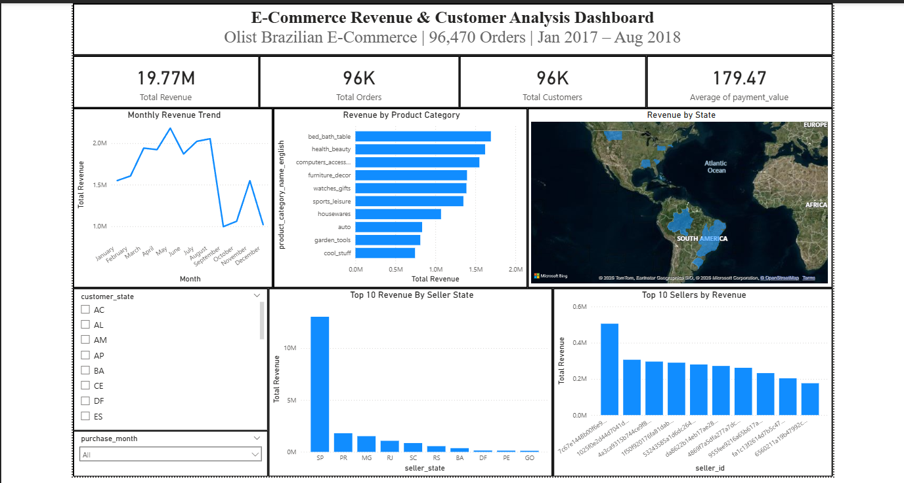
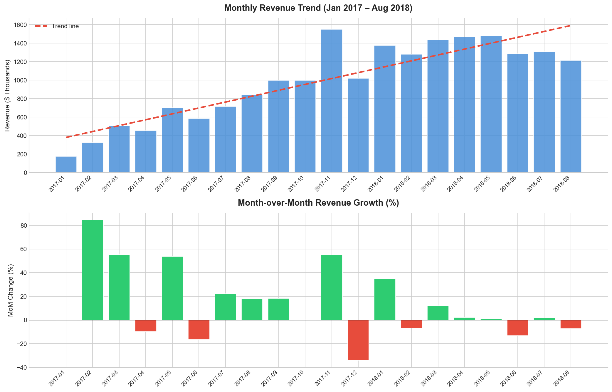
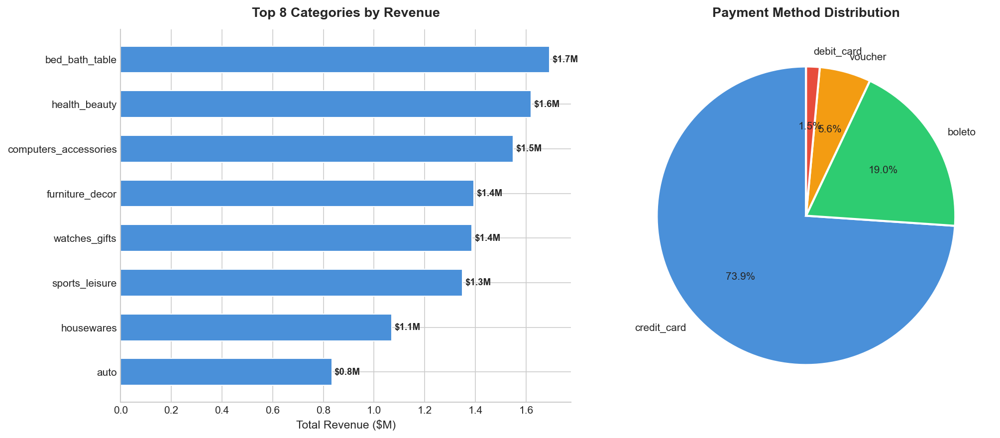
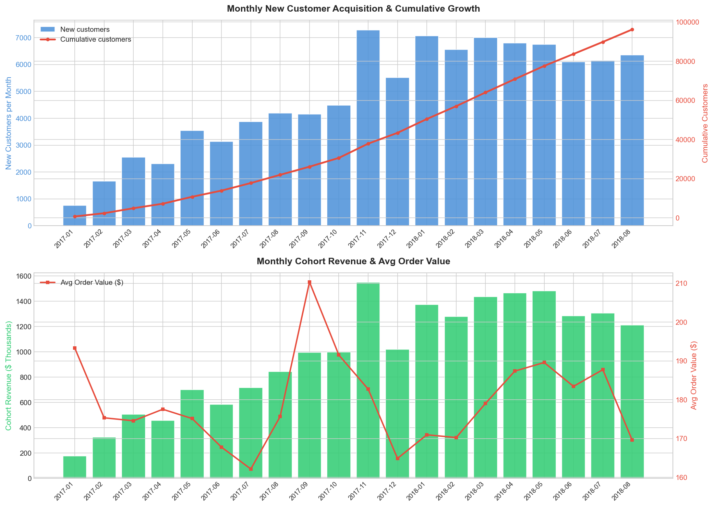
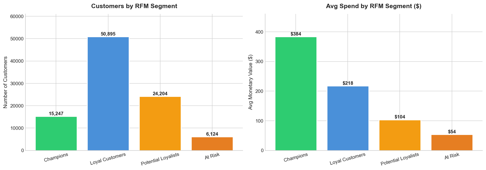

# E-Commerce Cohort & Revenue Analysis
### Understanding customer acquisition, revenue trends, and buying behavior across 96,470 orders

---

## Business Problem

An e-commerce marketplace needs to understand how its business is growing,
which customer segments are most valuable, and where revenue is concentrated
across products, states, and sellers.

This analysis answers:
- How is monthly revenue trending and what is the MoM growth rate?
- Which product categories and states drive the most revenue?
- How are customers segmented by value using RFM analysis?
- Which sellers and payment methods dominate the platform?
- What does new customer acquisition look like month over month?

---

## Dataset

| Property | Value |
|----------|-------|
| Source | Brazilian E-Commerce Public Dataset by Olist (Kaggle) |
| Tables | 8 related CSV files |
| Orders | 96,470 delivered orders |
| Items | 110,189 order items |
| Date Range | September 2016 – August 2018 |
| Geography | Brazil (27 states) |

### Tables Used

| Table | Rows | Description |
|-------|------|-------------|
| olist_orders_dataset | 99,441 | Order header — status, timestamps |
| olist_order_items_dataset | 112,650 | Items, prices, freight |
| olist_order_payments_dataset | 103,886 | Payment type and value |
| olist_customers_dataset | 99,441 | Customer state and city |
| olist_products_dataset | 32,951 | Product details |
| olist_sellers_dataset | 3,095 | Seller state |
| olist_order_reviews_dataset | 99,224 | Customer reviews |
| product_category_name_translation | 71 | Category names in English |

---

## Project Structure

~~~
Ecommerce-Cohort-Revenue-Analysis/
├── Data/
│   ├── olist_orders_dataset.csv
│   ├── olist_order_items_dataset.csv
│   ├── olist_order_payments_dataset.csv
│   ├── olist_customers_dataset.csv
│   ├── olist_products_dataset.csv
│   ├── olist_sellers_dataset.csv
│   ├── olist_order_reviews_dataset.csv
│   ├── product_category_name_translation.csv
│   └── ecommerce_clean_powerbi.csv
├── Notebooks/
│   └── ecommerce_analysis.ipynb
├── SQL/
│   └── ecommerce_queries.sql
├── Visuals/
│   ├── 01_monthly_revenue_trend.png
│   ├── 02_category_and_payment.png
│   ├── 03_customer_acquisition_cohort.png
│   └── 04_rfm_segments.png
├── Ecommerce_Cohort_Revenue_Analysis.pbix
├── Ecommerce_Cohort_Revenue_Analysis.pdf
└── README.md
~~~

---

## Methodology

### 1. Data Cleaning & Integration
Loaded all 8 CSV tables into Python, filtered to delivered orders only
(96,470 from 99,441 total), merged into a single master table of 110,189 rows,
translated product categories to English, and converted all date fields.

### 2. SQL Analysis (SQLite)
Wrote 6 business-focused queries covering monthly revenue trends, top product
categories, state-level revenue, payment method breakdown, top seller performance,
and weekday vs weekend order patterns — using window functions, CASE statements,
GROUP BY, and DISTINCT aggregations across the 8-table schema.

### 3. Python EDA
Built a complete analysis notebook with 4 visualizations — monthly revenue with
MoM growth, top categories by revenue, payment method distribution, customer
acquisition cohort analysis, and RFM customer segmentation.

### 4. Customer Acquisition Cohort Analysis
Since this marketplace has a very low repeat purchase rate (typical for Brazilian
e-commerce), we analyzed revenue cohorts by month — tracking how many new customers
joined each month and how much revenue each cohort generated. This reveals that
growth is entirely acquisition-driven, making new customer efficiency the #1 KPI.

### 5. RFM Customer Segmentation
Segmented all 96,470 customers into Champions, Loyal Customers, Potential Loyalists,
and At Risk tiers using Recency and Monetary scoring — giving the marketing team
an immediately actionable customer prioritization list.

### 6. Power BI Dashboard
Built an interactive 6-visual dashboard with KPI cards, monthly trend, category
breakdown, state map, seller performance, and interactive slicers by state and month.

---

## Key Results

### Core KPIs

| Metric | Value |
|--------|-------|
| Total Revenue | $19,774,782 |
| Total Orders | 96,470 |
| Unique Customers | 96,470 |
| Average Order Value | $179.47 |
| Total Items Sold | 110,189 |
| Date Range | Jan 2017 – Aug 2018 |

### SQL Findings

| Query | Key Finding |
|-------|-------------|
| Monthly Revenue | Grew from $176K (Jan 2017) to $1.52M peak (Nov 2017) — 8.6x growth |
| Top Category | bed_bath_table — $1.69M (8.5% of total revenue) |
| Top State | São Paulo (SP) — $7.4M (43% of total revenue) |
| Payment Method | Credit card — 73.92% of all transactions |
| Top Seller | Single SP seller — $505K revenue, 973 orders |
| Weekday vs Weekend | Weekday $15.5M vs Weekend $4.3M (3.6x difference) |

### Revenue by Top States

| State | Orders | Revenue | % of Total |
|-------|--------|---------|------------|
| São Paulo (SP) | 40,494 | $7.4M | 43.0% |
| Rio de Janeiro (RJ) | 12,350 | $2.7M | 15.6% |
| Minas Gerais (MG) | 11,354 | $2.3M | 13.3% |
| Rio Grande do Sul (RS) | 5,344 | $1.1M | 6.4% |
| Paraná (PR) | 4,923 | $1.0M | 6.0% |

### RFM Customer Segments

| Segment | Customers | Avg Spend | Avg Recency |
|---------|-----------|-----------|-------------|
| Champions | 15,247 | $384 | 114 days |
| Loyal Customers | 50,895 | $218 | 219 days |
| Potential Loyalists | 24,204 | $104 | 321 days |
| At Risk | 6,124 | $54 | 411 days |

---

## Visualizations

### Power BI Dashboard

### Monthly Revenue Trend & MoM Growth

### Revenue by Category & Payment Method Distribution

### Customer Acquisition Cohort Analysis

### RFM Customer Segmentation

---

## Business Recommendations

**Recommendation 1 — Re-engage Champions and prevent At Risk churn**

15,247 Champion customers average $384 spend — the highest value segment.
6,124 At Risk customers have not purchased in 411 days on average.
Action: Launch a VIP loyalty program for Champions with early access and
5% cashback. Simultaneously run a win-back campaign for At Risk customers
with a 15% discount on their most purchased category. Protecting the
Champions segment alone secures ~$5.8M in potential revenue.

**Recommendation 2 — Concentrate growth investment in SP and RJ**

São Paulo generates $7.4M (43%) and Rio de Janeiro $2.7M (16%) — together
59% of all revenue from just two states.
Action: Prioritize same-day delivery expansion, seller recruitment, and
performance marketing in SP and RJ before investing in smaller states.
Every acquisition dollar spent in SP returns significantly more than any
other geography based on current revenue concentration.

**Recommendation 3 — Convert Boleto users to installment credit card plans**

Credit card users average $163 order value vs $145 for Boleto — an $18 gap.
Across 19,784 Boleto transactions this represents ~$356K in potential uplift.
Action: Offer 3-installment interest-free credit card plans to Boleto users.
This matches the deferred payment behavior Boleto users prefer while migrating
them to a higher-value payment method that also reduces fraud risk.

---

## Tools Used

| Tool | Purpose |
|------|---------|
| Python / pandas | Data loading, cleaning, merging 8 tables |
| SQLite | 6 business SQL queries across full schema |
| matplotlib / seaborn | EDA visualizations and cohort charts |
| Power BI | Interactive 6-visual dashboard with slicers |
| Jupyter Notebook | End-to-end analysis environment |

---

*Analysis by Parshwa Gandhi
